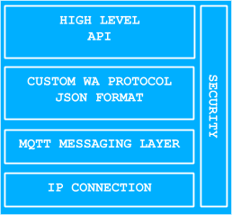

WolkConnect libraries are used to enable a device’s communication with [WolkAbout IoT Platform](https://demo.wolkabout.com/#/login).
Using WolkConnect libraries in the software or firmware of a device will drastically decrease the time to market for developers or anyone wanting to integrate their own product with WolkAbout IoT Platform.

WolkConnect libraries are intended to be used on IP enabled devices. The available WolkConnect libraries (implemented in the following programming languages [C](https://github.com/Wolkabout/WolkConnect-C), [C++](https://github.com/Wolkabout/WolkConnect-Cpp), [Java](https://github.com/Wolkabout/WolkConnect-Java-), [Python](https://github.com/Wolkabout/WolkConnect-Python), [Node-RED](https://github.com/Wolkabout/WolkConnect-Node-RED)) are platform independent for OS based devices, with a special note that the WolkConnect-C library is suitable to be adapted for the use on non-OS devices as WolkConnect libraries have a small memory footprint. More hardware specific WolkConnect libraries are available for [Arduino](https://github.com/Wolkabout/WolkConnect-Arduino), [MicroPython](https://github.com/Wolkabout/WolkConnect-MicroPython) and [Zerynth](https://github.com/Wolkabout/wolkabout-iot).

Features of WolkAbout IoT Platform that have been incorporated into WolkConnect libraries will be disambiguated with information on how to perform these features on devices by using WolkConnect’s API.

WolkConnect libraries are open-source and released under the [Apache License 2.0](https://github.com/Wolkabout/WolkConnect-Python/blob/master/LICENSE).

##Architecture

WolkConnect library is intended to be used as a dependency in other firmware or software that have their own existing business logic. WolkConnect library is not, by any means, a single service to control the device, it is a library intended to handle all the specific communication with WolkAbout IoT Platform.

Using a WolkConnect library requires minimal knowledge of WolkAbout IoT Platform, no knowledge of the internal mechanisms and protocols of WolkAbout IoT Platform is necessary. The user only utilizes APIs provided by WolkConnect library in the User Application Layer, thereby reducing time-to-market required.

The architecture of software/firmware where WolkConnect library is meant to be used is presented in _Fig.1.1_. The gray section in _Fig.1.1_ represents the developer's software/firmware.

The gray section between the User Application Layer and the Hardware Abstraction Layer represents the user’s libraries and drivers that are required for his project. Providing WolkConnect library with IP connectivity from the Hardware Abstraction Layer is expected from the user.

WolkConnect library is separated into layers as shown in _Fig.1.2_

WolkConnect libraries use IP connectivity provided by the OS, but on devices where this is not available, it is the user’s responsibility to provide implementations for opening a socket and send/receive methods to the socket.

Communication between WolkConnect library and WolkAbout IoT Platform is achieved through the use of the [MQTT messaging protocol](http://mqtt.org/). WolkConnect libraries have a common dependency, an implementation of an MQTT client that will exchange data with an MQTT server that is part of WolkAbout IoT Platform. The communication between WolkConnect library and WolkAbout IoT Platform is made secure with the use of Secure Sockets Layer (SSL) if the device and MQTT client library support it.

Another common dependency for WolkConnect libraries is a JSON library that is used for parsing data that is exchanged with WolkAbout IoT Platform. This data is formatted using a custom JSON based protocol defined by WolkAbout IoT Platform.

The high-level API represents what is available to the developer that is using WolkConnect library. APIs follow the naming convention of the programming language they were written in. Consult a specific WolkConnect library’s documentation for more information.
The API is divided into three parts: connection management, data handling and device management. Data handling is independent of device management on WolkAbout IoT Platform and therefore has a separate API. Device management is responsible for device health and this, in turn, increases the device’s lifespan.

## API's functional description

WolkConnect libraries separate device’s functionality through the API into three distinct parts:

* **Connection Management** - allows controlling the connected device in order to maintain data delivery integrity:
	* Connect
	* Disconnect
	* Ping keep-alive mechanism
* **Data Handling** - valuable data to be exchanged with WolkAbout IoT Platform:
	* Timestamp request
	* Sensors
	* Alarms
	* Actuators
* **Device management** - dynamical modification of the device properties with the goal to change device behavior:
	* Configuration Options
	* File Management
	* Device Software/Firmware Update

###Connection Management

Every connection from WolkConnect library to WolkAbout IoT Platform is authenticated with a device key and a device password. These credentials are created on WolkAbout IoT Platform when a device is created and are unique to that device. Only one active connection is allowed per device.

Attempting to create an additional connection with the same device credentials will terminate the previous connection. The connection is made secure, by default, in all WolkConnect libraries through the use of Secure Sockets Layer (SSL). Connecting without SSL is possible. For more information, refer to specific WolkConnect library documentation.

####Connect

A device can be connected to WolkAbout IoT Platform in two ways:

- **Always connected devices** - connect once and publish data when necessary. Actuations can only be used in this case, as sending actuations from WolkAbout IoT Platform are disabled when the device is offline.
- **Periodically connected devices** - connect and publish data when needed. It is important to use disconnect here, as this is a valid device state on WolkAbout IoT Platform -  controlled offline.

####Disconnect

Disconnecting will gracefully terminate the connection and the device will momentarily appear offline on WolkAbout IoT Platform. In cases of ungraceful disconnections, eg. due to a networking error, WolkAbout IoT Platform will be able to determine if the device is offline based on whether the device has sent its last will message.

####Ping keep-Alive Mechanism

The ping keep-alive mechanism will periodically send a message to WolkAbout IoT Platform. This message will update the device's last report time, which is useful if the device isn't publishing data often, as it gives the user the information that the device is still connected. The default interval for sending messages is 60 seconds. This mechanism can also be disabled to reduce bandwidth usage.

###Data Handling

Real world devices can perform a wide variety of operations that result in meaningful data. These operations could be to conduct a measurement, monitor certain conditions or execute some form of command. The data resulting from these operations have been modeled into three distinct types of data on WolkAbout IoT Platform: sensors, alarms, and actuators.

Information needs to be distinguishable, so every piece of data sent from the device needs to have an identifier. This identifier is called a reference, and all the references of a device on WolkAbout IoT Platform must be unique.

####Timestamp request

If the ping keep alive service is enabled on the device and a connection to the Platform has been established, then the user can request the UTC timestamp from the WolkConnect library.
This functionality is particularly useful on devices that don't have a real time clock, as it enables them to add timestamps to their data messages.
The timestamp is updated every time the ping keep-alive mechanism receives a response to its message.

####Sensor readings

Sensor readings are stored on the device before explicitly being published to WolkAbout IoT Platform. If the exact time when the reading occurred is meaningful information, it can be assigned to the reading as a UTC timestamp. If this timestamp is not provided, WolkAbout IoT Platform will assign the reading a timestamp when it has been received, treating the reading like it occurred the moment it arrived. UTC timestamps are integers that can be of second or millisecond precision.

Readings could be of a very high precision, and although this might not be fully displayed on the dashboard, the information is not lost and can be viewed on different parts of WolkAbout IoT Platform.

Sensor readings like GPS and accelerometers that hold more than one single information and these types of readings are supported in WolkConnect libraries and on WolkAbout IoT Platform. This concept is called a multi-value reading.

####Alarms

Alarms are derived from some data on the device and are used to indicate the state of a condition, eg. high-temperature alarm which emerged as a result of exceeding a threshold value on the device. Alarm value can either be on or off.

Like sensor readings, alarm messages are stored on the device before being published to WolkAbout IoT Platform. Alarms can also have a UTC timestamp to denote when the alarm occurred, but if the timestamp is omitted then WolkAbout IoT Platform will assign a timestamp when it receives the alarm message.

####Actuators

Actuators are used to enable WolkAbout IoT Platform to set the state of some part of the device, eg. flip a switch or change the gear of a motor.

Single actuation consists of the command to a device and feedback from the device. A command is a message that arrived at the device. Feedback is the current status of the actuator on the device which needs to be sent to WolkAbout IoT Platform in order to complete a single actuation process. Current status has two parameters: actuator value and actuator state. Value is current value of the actuator, eg. for a switch, it can be true or false. Possible actuator states are:

* **READY** - waiting to receive a command to change its value
* **BUSY** - in the process of changing its value
* **ERROR** - unable to comply

To perform a successful actuation, the user needs to know the actuator references that have been defined for his device on the Platform, to forward them during the actuation initialization period. The user has to implement an actuation handler that will execute the commands that have been issued from WolkAbout IoT Platform. Then the user has to implement an actuator status provider that will update WolkAbout IoT Platform with the current status of the actuator.
Publishing actuator statuses is performed immediately, but if the actuator takes time to be executed, eg. closing the gate, then the actuator status provider should update WolkAbout IoT Platform with the current values until it reaches the commanded value.
If the device is unable to publish the actuator status, then the information will be stored on the device until the next successful publish attempt.

To summarize, when the actuation command is issued from WolkAbout IoT Platform, it will be passed on to the actuation handler that will attempt to execute the command, and then the actuator status provider will report back to WolkAbout IoT Platform with the current value and the state of the actuator.

###Device Management

####Configuration

Configuration is the dynamical modification of the device properties from WolkAbout IoT Platform with the goal to change device behavior, eg. measurement heartbeat, sensors delivery reduction, enabling/disabling device interfaces, increase/decrease device logging level, etc.

Configuration requires the same way of handling messages as actuations do. When a configuration command is issued from WolkAbout IoT Platform, it will be passed to the configuration handler that will attempt to execute the command. Then the configuration status provider will report back to WolkAbout IoT Platform with the current values of the configuration parameters, with the addition that configuration parameters are always sent as a whole, even when only one value changes.

####File Management

Devices that have the ability to store files in permanent memory can support the file management feature. This enables the Platform to transfer files to the device in pieces via MQTT or optionally, if the device supports it, tell the device to download a file from a URL.
If the device supports this feature, it is expected that the device will publish a list of files present on it as soon as it establishes connection to the Platform.
Apart from commands to transfer new files to the device, the Platform can also issue commands to delete one or all files present on the device.

####Device Software/Firmware Update

WolkAbout IoT Platform gives the possibility of updating the device software/firmware.
To enable this functionality, the device is required to have file management enabled.
The process is separated into two autonomous stages:

- Start the process of installing a file on the device
- Verify installed software/firmware

The device needs to be connected to the Platform and deliver current software/firmware version to WolkAbout IoT Platform before starting to exploit utilize software/firmware update functionality.

WolkAbout IoT Platform actuates the device to start the process of installing. The responsibility to successfully install the file is on a device, not on WolkConnect library.
In order to update the firmware, the user must create a firmware handler.

This firmware handler will specify the following parameters:

- Current firmware version,
- Implementation of a firmware installer that will be responsible for the installation process, as well as the possibility of a command to abort the installation process.

##API Examples

To see how to utilize WolkConnect library APIs, visit one of the following files and look up detailed information in the Example Usage section:

- [Simple example README.md](https://github.com/Wolkabout/WolkConnect-Python/blob/master/README.md) - demonstrates the sending of a temperature sensor reading
- [Full feature set example README.md](https://github.com/Wolkabout/WolkConnect-Python/blob/master/examples/full_feature_set/README.md) - demonstrates full WolkAbout IoT Platform potential
